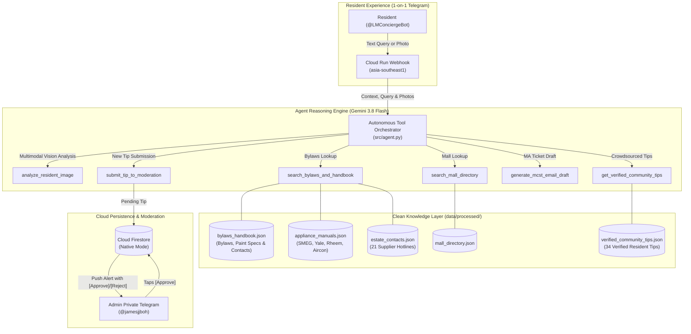

# Lentor Modern Digital Concierge & Resident Knowledge Base

[](https://cloud.google.com/run)
[](https://cloud.google.com/firestore)
[](https://ai.google.dev/)
[](https://t.me/LMConciergeBot)
[](https://opensource.org/licenses/MIT)

An autonomous, privacy-preserving 24/7 Digital Concierge and living knowledge base built for the **~605 households at Lentor Modern** (an integrated mixed-use development by GuocoLand in Singapore, atop Lentor Modern Mall and Lentor MRT).

Live Telegram Bot: **[@LMConciergeBot](https://t.me/LMConciergeBot)**

---

## 🎯 Product Purpose & Value Proposition

In large residential condominiums, residents encounter three distinct friction points:
1. **The 8:00 PM Desk Closure:** The physical concierge desk on Level 4 closes in the evening, leaving after-hours questions unanswered.
2. **Unsearchable Estate PDFs:** Official MCST by-laws and renovation guidelines are buried in 60-page PDF documents.
3. **Telegram Chat Noise:** Community groups repeat the same 15 questions every week (aircon ledge restrictions, broadband riser keys, Taobao delivery loading bays, mall clinic hours, and defect contractor tracking).

The **Lentor Modern Digital Concierge** bridges this gap as an **autonomous AI Agent** (not a brittle single-prompt RAG), dynamically choosing and chaining specialized tools to answer resident inquiries in private 1-on-1 chats.

---

## 🏗️ System Architecture



---

## 🛠️ The 7 Autonomous Agent Tools

| Tool | Purpose | Data Source |
| :--- | :--- | :--- |
| `search_bylaws_and_handbook(query)` | Queries official MCST by-laws, paint specifications (Intermatt BS E55, Dulux Thick Smoke 96YR 09/033), 8 appliance manuals (SMEG, Yale, Rheem, Mitsubishi), 21 supplier hotlines, Novade defect logging, and renovation rules. | `data/processed/bylaws_handbook.json` + `appliance_manuals.json` + `estate_contacts.json` |
| `search_mall_directory(category, shop_name)` | Looks up Lentor Modern Mall shops (CS Fresh, Minmed Clinic, Guardian, Toast Box, Mulberry Learning childcare), floor levels (`B1`, `L1`, `L2`), hours, direct online ordering/queuing links (via ResiQ), and verified resident discounts. | `data/processed/mall_directory.json` |
| `get_verified_community_tips(topic)` | Retrieves verified crowdsourced neighbour tips (Level 2 delivery intercom, 3.8m loading bay clearance, induction lock quirks, aircon piping SWG requirements, evening grocery discounts). | `data/processed/verified_community_tips.json` + Firestore approved tips |
| `generate_mcst_email_draft(issue_type, details)` | Formats structured, professional inquiries addressed to the Managing Agent (CBRE at `managementoffice@LT-MODERN.COM`). | Dynamic Agent Template |
| `submit_tip_to_moderation(topic, tip_text)` | Automatically structures resident discoveries and queues them for admin moderation. | Firestore `community_tips/` queue |
| `submit_developer_feedback(category, details)` | Captures resident suggestions, bug reports, or data corrections and routes them directly to the bot creator & admin (@jamesjjboh). | Firestore `resident_feedback/` queue |
| `search_estate_profile(query)` | Looks up verified estate specs (GuocoLand, 605 units across 3 towers), unit mix & bathroom configurations, Lentor MRT (TE5) first/last train timings, bus lines (825, 855, 852), and official MOE primary school proximity tiers (Anderson Primary strictly <1km; CHIJ St. Nicholas 1–2km). | `data/processed/estate_profile.json` |

---

## ⚡ Superpowers & Admin Features

### 1. In-Chat Interactive Moderation
* When a resident submits a tip via `/tip <topic> <content>`, the agent pushes an interactive alert directly to the Admin's private Telegram chat:
  > 🔔 **New Resident Tip Submitted:**  
  > *Topic:* Mall  
  > *Tip:* "CS Fresh sushi 20% discount starts at 8:30pm"  
  > `[ ✅ Approve ]` `[ ❌ Reject ]`
* Tapping `[ ✅ Approve ]` updates Firestore status to `approved`, making it instantly live for all ~605 households.

### 2. Estate Broadcast Engine (`/broadcast`)
* Admin command: `/broadcast 📢 Lift maintenance for Tower 1 tomorrow from 10am to 12pm.`
* Iterates through all registered users in Firestore with safety rate-limiting (25 msgs/sec).

### 3. Product Analytics & Content Gaps (`/admin_stats [7|30|all]`)
An instant, text-first dashboard (no chart rendering), with inline buttons `[ 7d ] [ 30d ] [ All ] [ 📋 Full gap list ] [ 🔄 Refresh ]`.

| Metric | Definition |
| :--- | :--- |
| **Registered users** | Unique Telegram accounts that have started or messaged the bot. This is **not** a household count: one home may have several users, and no unit numbers are collected (privacy by design). |
| **New / Active 7d / Active 30d** | Users first seen in the window, and users active in the last 7 / 30 days. |
| **Adoption ≈** | Registered users ÷ 605 units. An approximation only (users, not households). |
| **Questions asked** | Typed and photo questions in the window. Quick-menu taps are tracked separately and are *not* counted as questions. |
| **Answer rate** | Share of questions the bot could answer, detected from the reply wording (e.g. "I don't have…", "No shops found…", "couldn't find…"), not just two fixed phrases. |
| **Top topics** | Questions grouped by the tool used (handbook, mall, transit/estate profile, tips, etc.). |
| **Quick-menu taps** | How often each `/menu` button is used. |
| **Content gaps** | Unanswered questions, de-duplicated and ranked by how often they were asked (`"Is there a pet salon?" ×7`). |
| **Feedback** | Totals, new/unresolved count, breakdown by type (bug / data correction / feature request) and age of the oldest unresolved item. |

* **Daily sparkline:** a 7-day question trend, e.g. `▁▃▅▂▇▄▂`.
* **Conversational analytics (admin only):** just ask in chat, e.g. *"What did residents ask most this week?"* or *"How many users do we have?"*. Gemini answers using only the verified aggregates (never raw resident messages) and cites exact numbers.

### 4. Multimodal Vision & Photo Ingestion
* Residents can snap photos of mall flyers, opening hours notices, or appliance error codes directly in Telegram without typing.
* **Auto-Intent Classification:** Automatically categorizes photos into either a *Community Tip* (e.g., CS Fresh promotions), *Bug/Feedback* (with screenshot), or a *Resident Query* (e.g., induction cooker error code "L").
* **Photo Moderation Cards:** For tips, pushes the resident's photo directly to the Admin's private Telegram chat with interactive inline `[ ✅ Approve ]` / `[ ❌ Reject ]` buttons.
* **Privacy by Design:** Strict Singapore PII scrubber ensures unit numbers, phone numbers, and resident identities are stripped before publication.

### 5. Native Swipe-to-Reply & Tap-to-Reply Resident Feedback
* Residents can submit feature requests or report bugs via `/feedback <idea>`, `/bug <issue>`, or natural chat.
* **Instant Admin Notification:** Pushes a card with resident details directly to Admin's private Telegram.
* **Native Swipe-to-Reply:** Admin simply swipes left on the notification card like a normal chat message, types their response, and hits send. The bot routes the message directly into the resident's 1-on-1 chat.
* **Tap-to-Reply:** Inline button `[ 💬 Reply ]` triggers Telegram `ForceReply` for 1-tap mobile reply mode.
* **Serverless Resilient:** Stores message mappings in Firestore (`admin_reply_mappings/`) so swipe-to-reply works seamlessly even after Cloud Run restarts.

### 6. Interactive 1-Tap Quick Menu (`/menu`)
* Residents can pull up immediate answers without consuming AI tokens:
  * **Estate Contacts:** Managing Agent (CBRE), Concierge Desk, 24/7 Security Hotline, and Customer Service.
  * **Facilities & Gym:** Gym hours (6am–10pm), pool hours (7am–10pm), tennis court, BBQ, and car wash bays.
  * **Transit & Buses:** Lentor MRT (TE5) first/last train timings and Exit 1 buses (825, 855, 852).
  * **Mall & Deals:** CS Fresh, Mulberry Learning, ResiQ ordering links, and 31 merchant resident discounts.
  * **Moving & Reno:** Renovation hours, deposit schedule, loading bay clearance (3.8m), and official paint codes.
  * **iPlus Living Guide:** Mobile intercom buzzer video setup, property activation codes, and facility booking rules.

### 7. Responsive UX: In-Chat Status Bubbles & 1-Tap Fallback Action Cards
* **In-Chat Progress Status Bubble:** Matches modern interactive bot UX by posting immediate feedback directly below the resident's message (`🔍 Looking that up for you with Gemini AI...` for text, `📥 Downloading image...` $\rightarrow$ `🔍 Analyzing with Gemini Vision AI...` for photos) and seamlessly editing it into the response.
* **Typing Indicator Heartbeat:** Background heartbeat task continuously refreshes Telegram's `ChatAction.TYPING` every 3.5 seconds, ensuring residents always see that the bot is actively thinking and working on their question.
* **Warm Container Response:** Cloud Run maintains `--min-instances 1` to eliminate container cold starts.
* **Empathetic Concierge Fallback Cards:** If a resident asks a question outside existing bylaws or directories, the bot provides warm concierge signposting and attaches 1-tap action buttons:
  * `[ ✉️ Draft Email to MA ]`: Generates a formatted inquiry email to CBRE (`managementoffice@LT-MODERN.COM`).
  * `[ 🏢 On-Site Contacts ]`: Displays estate office phone hotlines and locations.
  * `[ ◀️ Quick Menu ]`: Jumps back to main quick shortcuts.

---

## 💰 Zero-Cost Serverless Architecture ($0.00 / month)

| Cloud Component | Service Tier | Monthly Cost |
| :--- | :--- | :--- |
| **Hosting** | Google Cloud Run (`asia-southeast1`) | **\$0.00** (Free Tier includes 2 million requests + 360,000 GiB-seconds / month; warm instance with 512MiB memory) |
| **Database** | Google Cloud Firestore (Native Mode) | **\$0.00** (Uses <1% of 50k free reads/day) |
| **Storage / Registry** | Google Artifact Registry | **\$0.00** (Automated cleanup keeps $\le 2$ builds, < 380 MB of 500 MB Free Tier) |
| **AI Inference** | Google Gemini 3.8 Flash (with 3.5 / 3.1 fallback cascade) | **\$0.00** (Generous API tier) |

### Automated Artifact Registry Cleanup Policy
To ensure container images never trigger storage billing (avoiding historical build accumulation):
```bash
gcloud artifacts repositories set-cleanup-policies cloud-run-source-deploy \
    --location=asia-southeast1 \
    --policy=scripts/cleanup-policy.json \
    --no-dry-run
```
* **Rule 1 (`keep-latest-two-versions`)**: Protects the active and backup container images.
* **Rule 2 (`delete-old-images`)**: Automatically deletes builds older than 1 day upon new release.

---

## 🛡️ Privacy & Strict Singapore PII Sanitization

Before raw chat exports or community submissions touch the knowledge base, [src/parser.py](file:///Users/jamesboh/Lentor%20Modern%20Concierge/src/parser.py) applies multi-stage redaction:
* **Singapore Unit Numbers:** `#\d{1,2}-\d{2,4}` $\rightarrow$ `[UNIT_REDACTED]`
* **Singapore Phone Numbers:** `(?:\+?65)?[89]\d{7}` $\rightarrow$ `[PHONE_REDACTED]`
* **Email Addresses:** `[\w\.-]+@[\w\.-]+\.\w+` $\rightarrow$ `[EMAIL_REDACTED]`
* **Telegram Usernames:** `@[A-Za-z0-9_]+` $\rightarrow$ `[USER_HANDLE]`
* **Noise Stripping:** Automatically removes fillers (*"thanks"*, *"ok"*, stickers, service notices).

---

## 🚀 Setup & Local Development

### 1. Clone & Setup Environment
```bash
git clone https://github.com/Jamesjjboh/Lentor-Modern-Concierge.git
cd Lentor-Modern-Concierge
python3 -m venv .venv
source .venv/bin/activate
pip install -r requirements.txt
```

### 2. Configure Environment (`.env`)
```bash
cp .env.example .env
```
Fill in:
* `GEMINI_API_KEY`: Google AI Studio API Key.
* `TELEGRAM_BOT_TOKEN`: Token from `@BotFather`.
* `ADMIN_TELEGRAM_ID`: Your personal Telegram ID from `@userinfobot`.
* `GCP_PROJECT_ID`: `gen-lang-client-0682470012`

### 3. Run Locally (Long Polling)
```bash
python -m src.bot
```

### 4. Deploy to Google Cloud Run (Singapore)
```bash
./deploy.sh
```

---

## 📁 Repository Directory Structure

```text
Lentor Modern Concierge/
├── data/
│   ├── raw/                  # Raw PDFs & Telegram exports (strictly git-ignored)
│   └── processed/            # Cleaned, PII-scrubbed JSON knowledge chunks
├── scripts/
│   ├── cleanup-policy.json   # Artifact Registry lifecycle policy (keeps max 2 builds)
│   └── ingest_knowledge.py   # Knowledge ingestion pipeline (PDFs, chat exports, ResiQ)
├── src/
│   ├── __init__.py
│   ├── config.py             # Decoupled environment & model settings
│   ├── parser.py             # PDF extractor & Singapore PII scrubber
│   ├── database.py           # Firestore client & query models
│   ├── agent.py              # Gemini 3.8 Flash agent & 7 tools
│   ├── analytics.py          # Admin analytics engine: metrics, content gaps, dashboard, Q&A
│   ├── admin.py              # In-chat moderation callbacks, /broadcast & /admin_stats
│   └── bot.py                # Telegram bot, 1-tap /menu & webhook runner
├── tests/
│   └── test_analytics.py     # Unit tests for the analytics engine
├── Dockerfile                # Production Cloud Run container specification
├── deploy.sh                 # Zero-downtime deployment script with webhook registration
├── requirements.txt          # Python dependencies
├── CHANGELOG.md              # Semantic release history
└── README.md                 # Project documentation
```

### Run the tests
```bash
PYTHONPATH=. python -m unittest tests.test_analytics
```

---

## 👤 Author & Maintainer
Built and maintained by **James Boh** for the residents of Lentor Modern.
