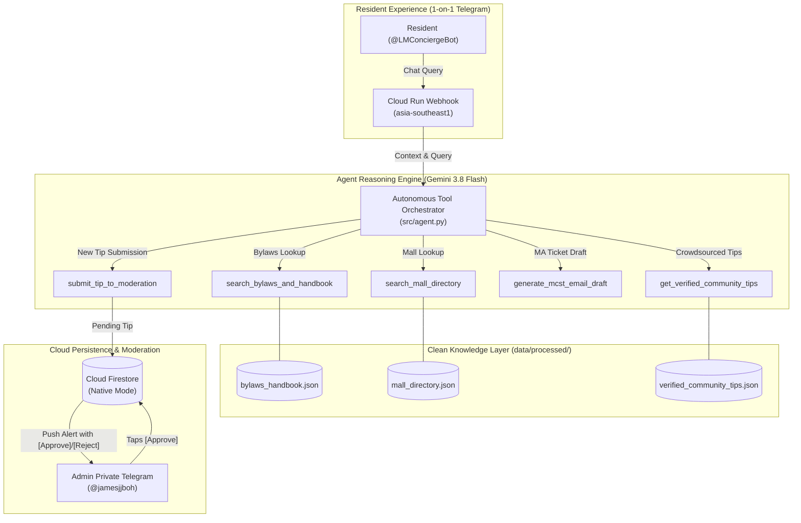

# Lentor Modern Digital Concierge & Resident Knowledge Base

[](https://cloud.google.com/run)
[](https://cloud.google.com/firestore)
[](https://ai.google.dev/)
[](https://t.me/LMConciergeBot)
[](https://opensource.org/licenses/MIT)

An autonomous, privacy-preserving 24/7 Digital Concierge and living knowledge base built for the **~605 households at Lentor Modern** (an integrated mixed-use development by GuocoLand in Singapore, atop Lentor Modern Mall and Lentor MRT).

Live Telegram Bot: **[@LMConciergeBot](https://t.me/LMConciergeBot)**

---

## 🎯 Product Purpose & Value Proposition

In large residential condominiums, residents encounter three distinct friction points:
1. **The 8:00 PM Desk Closure:** The physical concierge desk on Level 4 closes in the evening, leaving after-hours questions unanswered.
2. **Unsearchable Estate PDFs:** Official MCST by-laws and renovation guidelines are buried in 60-page PDF documents.
3. **Telegram Chat Noise:** Community groups repeat the same 15 questions every week (aircon ledge restrictions, broadband riser keys, Taobao delivery loading bays, mall clinic hours, and defect contractor tracking).

The **Lentor Modern Digital Concierge** bridges this gap as an **autonomous AI Agent** (not a brittle single-prompt RAG), dynamically choosing and chaining specialized tools to answer resident inquiries in private 1-on-1 chats.

---

## 🏗️ System Architecture



---

## 🛠️ The 5 Autonomous Agent Tools

| Tool | Purpose | Data Source |
| :--- | :--- | :--- |
| `search_bylaws_and_handbook(query)` | Queries official MCST by-laws, renovation working hours, deposit schedules, lift booking rules, and defect protocols. | `data/processed/bylaws_handbook.json` |
| `search_mall_directory(category, shop_name)` | Looks up Lentor Modern Mall shops (CS Fresh, Minmed Clinic, Guardian, Toast Box), floor levels (`B1`, `L1`), and hours. | `data/processed/mall_directory.json` |
| `get_verified_community_tips(topic)` | Retrieves verified crowdsourced neighbour tips (Taobao loading bay directions, induction cooker lock quirks, aircon copper piping SWG requirements). | `data/processed/verified_community_tips.json` + Firestore approved tips |
| `generate_mcst_email_draft(issue_type, details)` | Formats structured, professional inquiries ready to copy-paste to the Managing Agent (MA). | Dynamic Agent Template |
| `submit_tip_to_moderation(topic, tip_text)` | Automatically structures resident discoveries and queues them for admin approval. | Firestore `community_tips/` queue |

---

## ⚡ Superpowers & Admin Features

### 1. In-Chat Interactive Moderation
* When a resident submits a tip via `/tip <topic> <content>`, the agent pushes an interactive alert directly to the Admin's private Telegram chat:
  > 🔔 **New Resident Tip Submitted:**  
  > *Topic:* Mall  
  > *Tip:* "CS Fresh sushi 20% discount starts at 8:30pm"  
  > `[ ✅ Approve ]` `[ ❌ Reject ]`
* Tapping `[ ✅ Approve ]` updates Firestore status to `approved`, making it instantly live for all ~605 households.

### 2. Estate Broadcast Engine (`/broadcast`)
* Admin command: `/broadcast 📢 Lift maintenance for Tower 1 tomorrow from 10am to 12pm.`
* Iterates through all registered users in Firestore with safety rate-limiting (25 msgs/sec).

### 3. Product Analytics & Content Gaps (`/admin_stats`)
* Displays total registered households, total query volume, and a list of **unanswered questions** (highlighting missing estate documentation or untracked mall shops).

---

## 💰 Zero-Cost Serverless Architecture ($0.00 / month)

| Cloud Component | Service Tier | Monthly Cost |
| :--- | :--- | :--- |
| **Hosting** | Google Cloud Run (`asia-southeast1`) | **\$0.00** (Scales to 0 instances when idle) |
| **Database** | Google Cloud Firestore (Native Mode) | **\$0.00** (Uses <1% of 50k free reads/day) |
| **Storage / Registry** | Google Artifact Registry | **\$0.00** (Automated cleanup keeps $\le 2$ builds, < 380 MB of 500 MB Free Tier) |
| **AI Inference** | Google Gemini 3.8 Flash (with 3.5 / 3.1 fallback cascade) | **\$0.00** (Generous API tier) |

### Automated Artifact Registry Cleanup Policy
To ensure container images never trigger storage billing (avoiding historical build accumulation):
```bash
gcloud artifacts repositories set-cleanup-policies cloud-run-source-deploy \
    --location=asia-southeast1 \
    --policy=scripts/cleanup-policy.json \
    --no-dry-run
```
* **Rule 1 (`keep-latest-two-versions`)**: Protects the active and backup container images.
* **Rule 2 (`delete-old-images`)**: Automatically deletes builds older than 1 day upon new release.

---

## 🛡️ Privacy & Strict Singapore PII Sanitization

Before raw chat exports or community submissions touch the knowledge base, [src/parser.py](file:///Users/jamesboh/Lentor%20Modern%20Concierge/src/parser.py) applies multi-stage redaction:
* **Singapore Unit Numbers:** `#\d{1,2}-\d{2,4}` $\rightarrow$ `[UNIT_REDACTED]`
* **Singapore Phone Numbers:** `(?:\+?65)?[89]\d{7}` $\rightarrow$ `[PHONE_REDACTED]`
* **Email Addresses:** `[\w\.-]+@[\w\.-]+\.\w+` $\rightarrow$ `[EMAIL_REDACTED]`
* **Telegram Usernames:** `@[A-Za-z0-9_]+` $\rightarrow$ `[USER_HANDLE]`
* **Noise Stripping:** Automatically removes fillers (*"thanks"*, *"ok"*, stickers, service notices).

---

## 🚀 Setup & Local Development

### 1. Clone & Setup Environment
```bash
git clone https://github.com/Jamesjjboh/Lentor-Modern-Concierge.git
cd Lentor-Modern-Concierge
python3 -m venv .venv
source .venv/bin/activate
pip install -r requirements.txt
```

### 2. Configure Environment (`.env`)
```bash
cp .env.example .env
```
Fill in:
* `GEMINI_API_KEY`: Google AI Studio API Key.
* `TELEGRAM_BOT_TOKEN`: Token from `@BotFather`.
* `ADMIN_TELEGRAM_ID`: Your personal Telegram ID from `@userinfobot`.
* `GCP_PROJECT_ID`: `gen-lang-client-0682470012`

### 3. Run Locally (Long Polling)
```bash
python -m src.bot
```

### 4. Deploy to Google Cloud Run (Singapore)
```bash
./deploy.sh
```

---

## 📁 Repository Directory Structure

```text
Lentor Modern Concierge/
├── data/
│   ├── raw/                  # Raw PDFs & Telegram exports (strictly git-ignored)
│   └── processed/            # Cleaned, PII-scrubbed JSON knowledge chunks
├── scripts/
│   └── cleanup-policy.json   # Artifact Registry lifecycle policy (keeps max 2 builds)
├── src/
│   ├── __init__.py
│   ├── config.py             # Decoupled environment & model settings
│   ├── parser.py             # PDF extractor & Singapore PII scrubber
│   ├── database.py           # Firestore client & O(1) query models
│   ├── agent.py              # Gemini 3.8 Flash agent & 5 tools
│   ├── admin.py              # In-chat moderation callbacks & /broadcast engine
│   └── bot.py                # Telegram bot application & webhook runner
├── Dockerfile                # Production Cloud Run container specification
├── deploy.sh                 # Zero-downtime deployment script with webhook registration
├── requirements.txt          # Python dependencies
├── CHANGELOG.md              # Semantic release history
└── README.md                 # Project documentation
```

---

## 👤 Author & Maintainer
Built and maintained by **James Boh** for the residents of Lentor Modern.
